Graph theory based approach to identify phase transitions in condensed matter
==============

This repository contains the implementation of key algorithms, computed results, and Python scripts for visualizing all figures from the article "Graph theory based approach to identify phase transitions in condensed matter".

The related article is published in Physical Review B (PRB) and can be accessed at https://journals.aps.org/prb/abstract/10.1103/PhysRevB.111.054116.

Computation of Cut Distance
-----------------

See "cut_dist" directory.

Reference
-----------------

Please consider adding the following citation if you use this work in your research.

```bibtex
@article{wang2025graph,
  title={Graph theory based approach to identify phase transitions in condensed matter},
  author={Wang, An and Sosso, Gabriele C},
  journal={Physical Review B},
  volume={111},
  number={5},
  pages={054116},
  year={2025},
  publisher={APS}
}
```

Figures
-----------------

The generation of Fig.6 requires the complete trajectory data from the KA system simulation. This data has been uploaded to Baidu Netdisk at the following link: https://pan.baidu.com/s/13V_jR030NeefVrGKnXca4Q and the access code is: f9ud. For readers who do not have access to Baidu Netdisk, please contact me directly if you need this data. My email is An.Wang@warwick.ac.uk.


All python scripts in "Plot" directory reproduces the computed figures in the article, including Fig.2b), Fig.2c), Fig.3a), Fig.3b), Fig.4a), Fig.4b), Fig.5b), Fig.5c), Fig.8a) and Fig.8b). Besides, the generated figures are saved in "Figure" directory, demonstrated as follow:


Fig.2b)

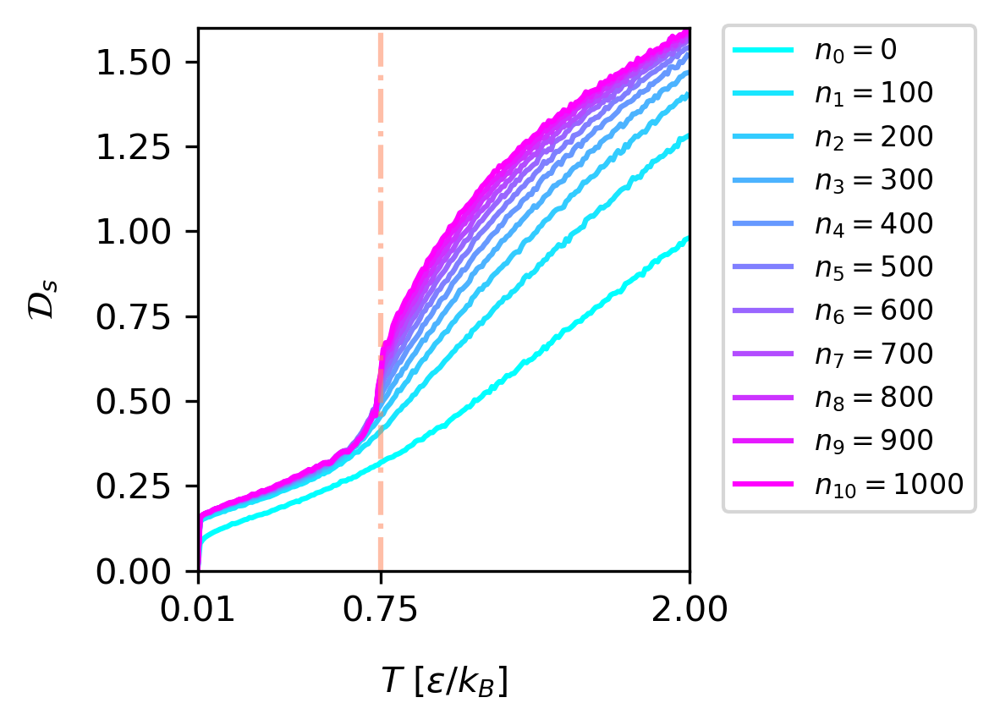

Fig.2c)

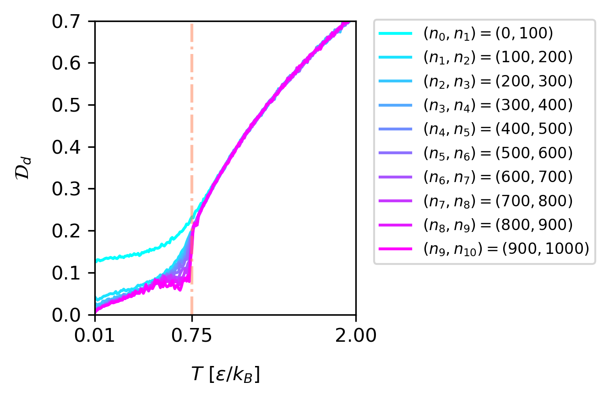

Fig.3a)

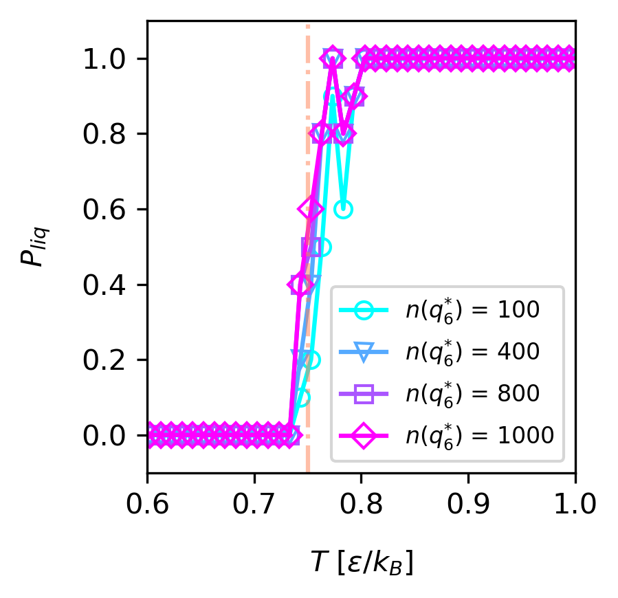

Fig.3b)

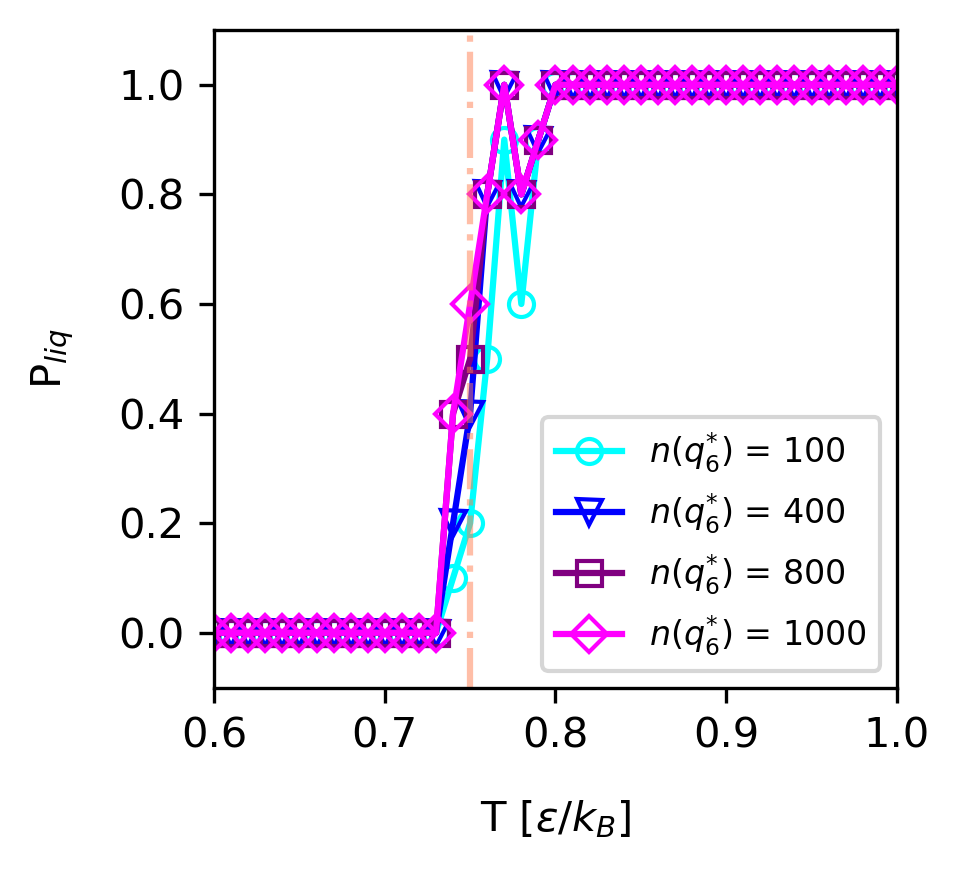

Fig.4a)

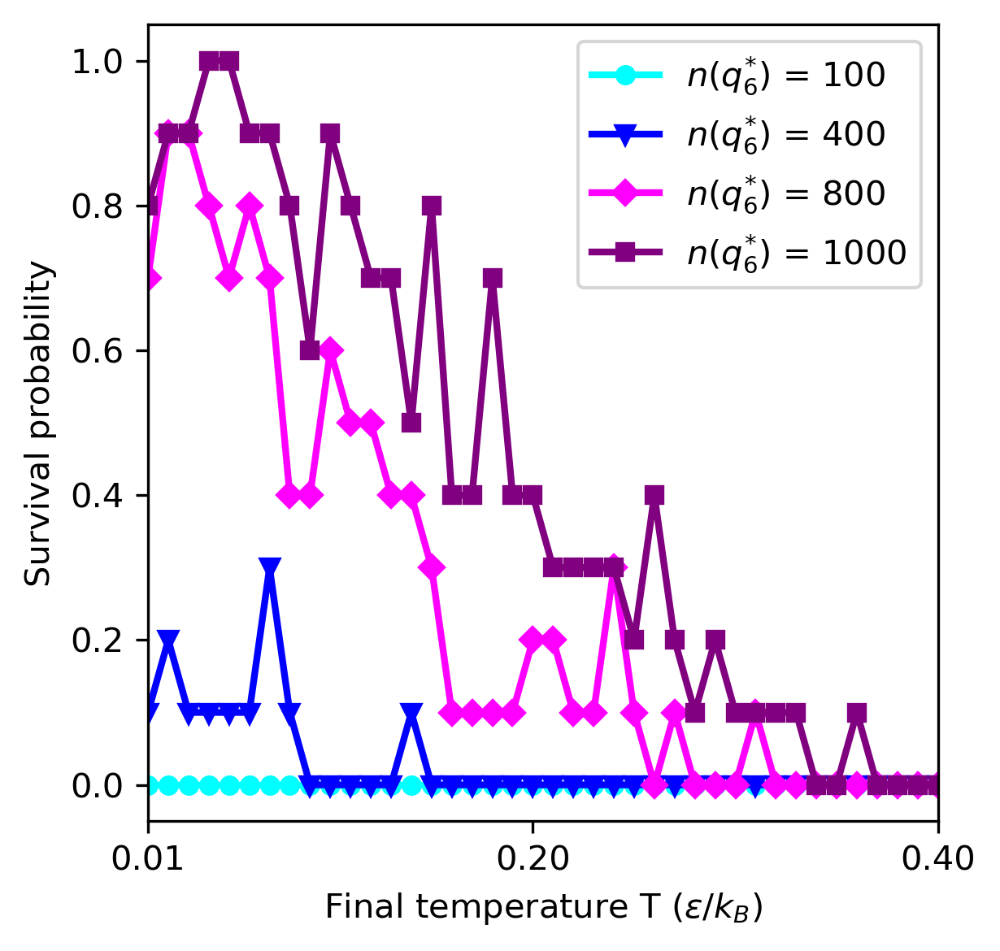

Fig.4b)

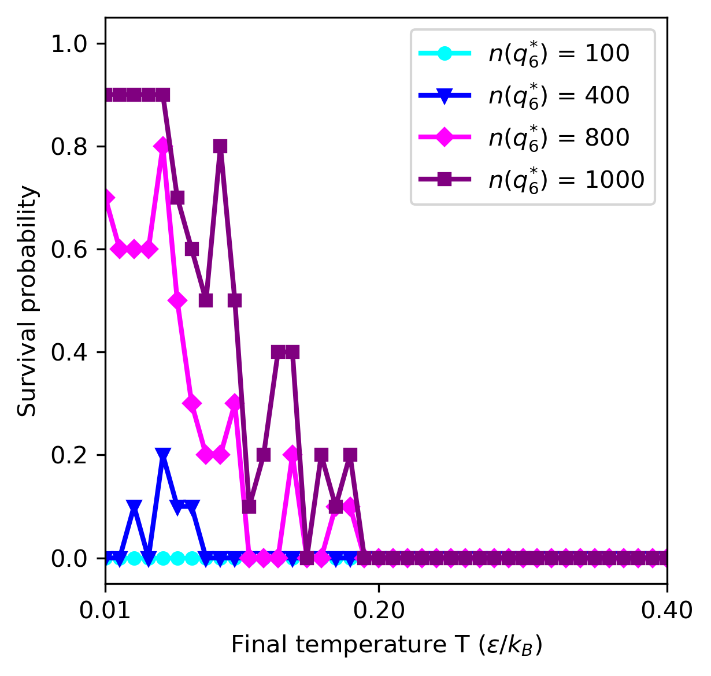

Fig.5b)

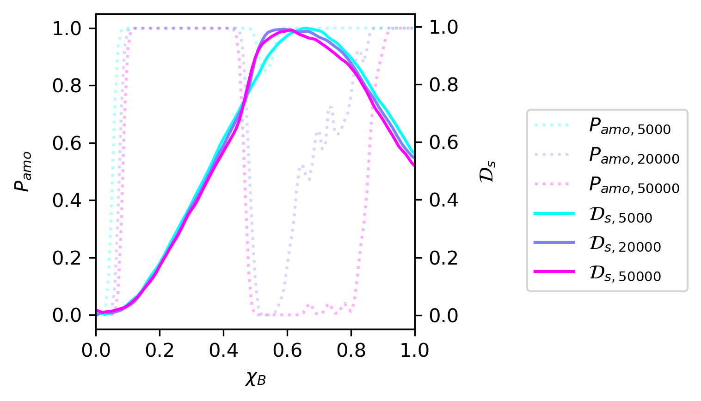

Fig.5c)

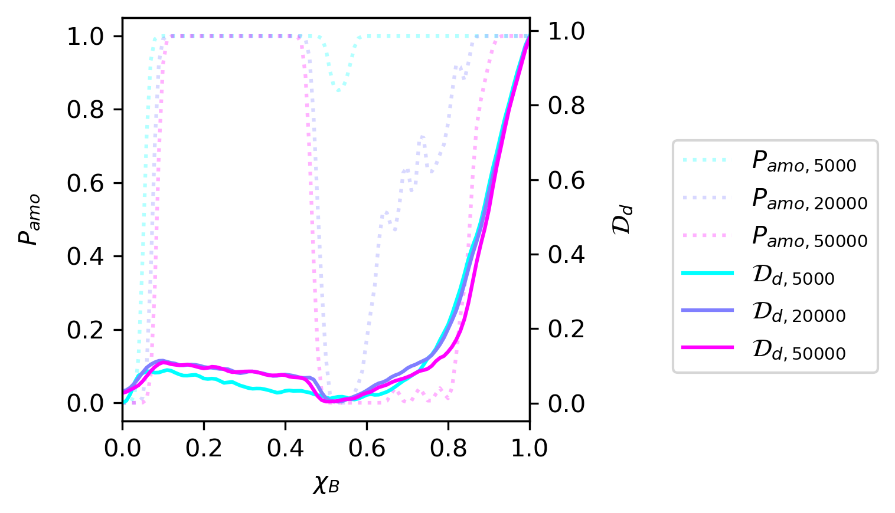

Fig.8a)

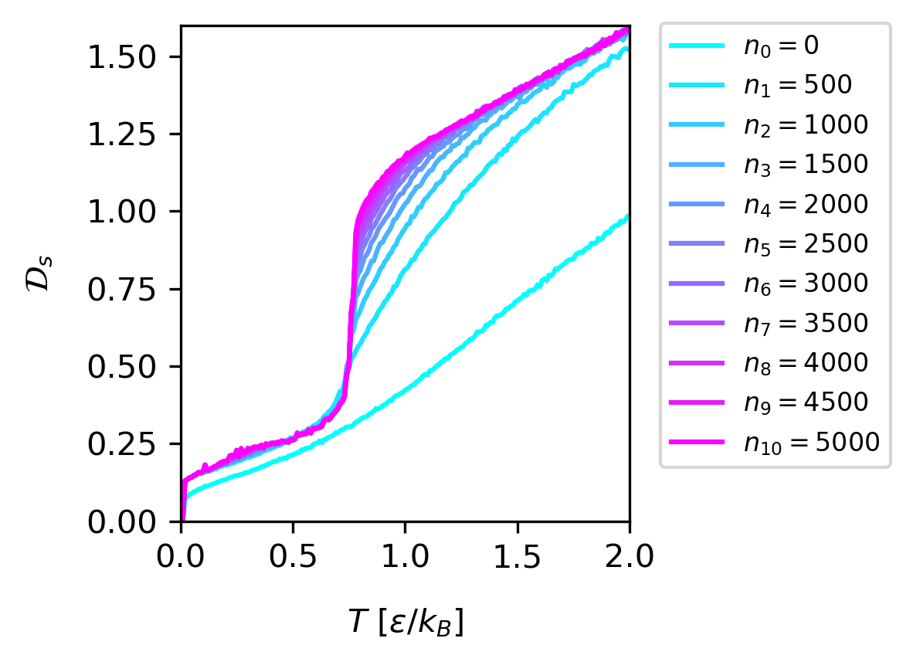

Fig.8b)

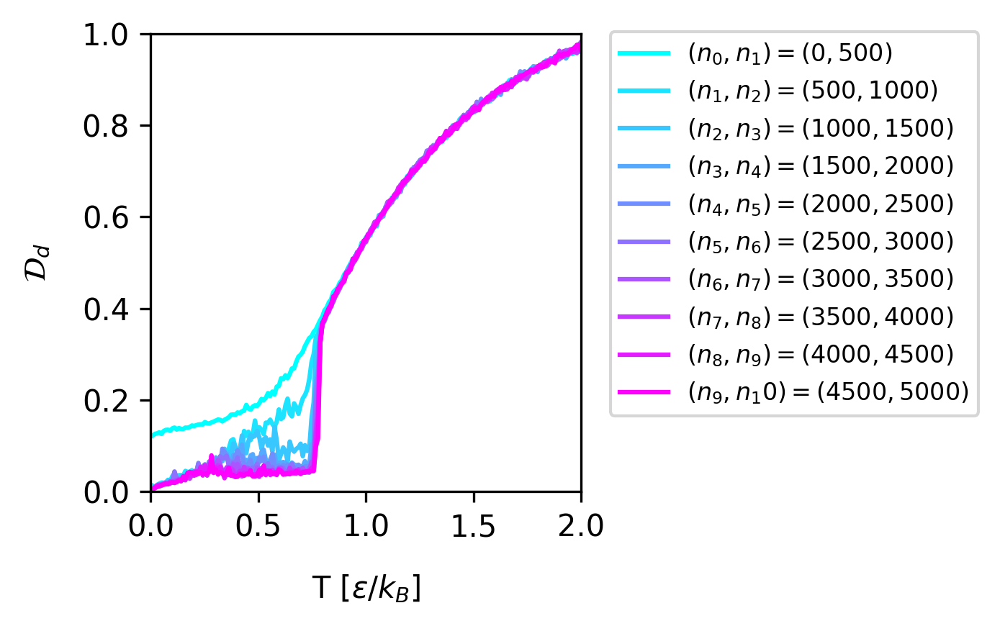


Molecular Dynamics (MD) Simulation
-----------------

See "MD_simulation" directory for the LAMMPS scripts.

Graph Construction:
Fully connected graphs with edge weights representing the spatial distances of particles.


Others
-----------------
This article has topped the download rankings of PRB, see https://x.com/PhysRevB/status/1898772287639163017.
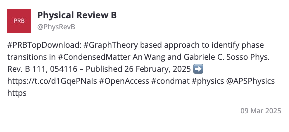
